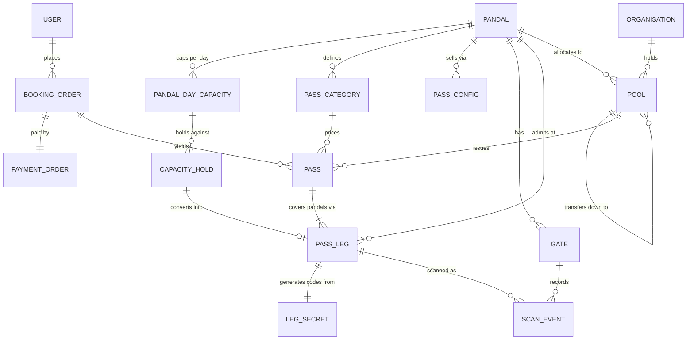

# eDurgaPuja — Data Model

Derived from `FunctionalRequirements.md` and the decisions in `Decisions.md`.
Where a table exists because of a decision, the decision is named.

---

## 0 · Principles

1. **Money is integer paise.** No floats, no rupee decimals, anywhere. A column
   named `*_paise` is a `bigint`.
2. **Primary keys are UUIDv7** — opaque to the outside world, time-ordered so
   index inserts stay local when a whole city books in the same fortnight.
3. **Invariants live in the database, not only in code.** Anything that must never
   be true is a `CHECK` constraint or a unique index. Application logic is the
   second line, not the first.
4. **Holds are rows, not counters.** An expired hold stops occupying capacity
   whether or not a sweeper has run.
5. **Every externally-visible identifier is a reference, never an authenticator.**
   Knowing a pass code gets you nothing (FR-065).

---

## 1 · The inventory core

This is the only part of the schema where being wrong is expensive, so it is
specified first and in more detail than the rest.

### What the client decided

- Each pandal defines a capacity **per day** (D2, Q1).
- No more passes than that are issued for that pandal on that day.
- A City Pass consumes one unit from **each** pandal it covers, on its chosen
  date (Q3).

So the unit of inventory is **(pandal, date)**, and every product consumes from
it identically. That uniformity is what makes the invariant tractable.

### `pandal_day_capacity`

| Column | Type | Notes |
|---|---|---|
| `id` | uuid | |
| `pandal_id` | uuid → `pandal` | |
| `date` | date | |
| `capacity` | int | set by the pandal |
| `issued_count` | int | maintained under row lock |
| `is_open` | bool | closes a day without deleting its history |

```
UNIQUE (pandal_id, date)
CHECK  (issued_count >= 0)
CHECK  (issued_count <= capacity)      -- the one that must never break
```

The `CHECK` is the floor. No bug, no race, no bad migration can put more passes
into a day than the pandal allowed, because the database refuses the write.

Rows exist only for pandals where `sells_passes` is true. A page-only pandal has
no capacity, no configuration and no legs pointing at it — and a City Pass may
not cover one (FR-069).

### `capacity_hold`

| Column | Type | Notes |
|---|---|---|
| `id` | uuid | |
| `pandal_day_id` | uuid → `pandal_day_capacity` | |
| `order_id` | uuid → `booking_order` | |
| `quantity` | int | the party size being held |
| `expires_at` | timestamptz | |
| `released_at` | timestamptz null | set when converted or abandoned |

```
CHECK (quantity > 0)
INDEX (pandal_day_id, expires_at) WHERE released_at IS NULL
```

**Availability** for a day is computed, never stored:

```
available = capacity
          − issued_count
          − Σ quantity of holds where released_at IS NULL AND expires_at > now()
```

A hold that expires stops counting the instant it expires. The sweeper that sets
`released_at` is housekeeping; correctness does not depend on it having run.

### The two operations

Both take the `pandal_day_capacity` row lock (`SELECT … FOR UPDATE`) and do
nothing else inside the lock. The lock is per pandal per day, so two pandals
never contend, and the Ashtami stampede contends only on the rows it must.

```
place_hold(pandal, date, qty, order)   →  hold row, or NoCapacity
issue(hold)                            →  issued_count += qty, hold released
```

`release_hold` and `expire_holds` complete the set. Nothing else in the codebase
may write `issued_count`.

### What is deliberately absent

**Per-slot capacity.** The client capped the day, not the slot. That is recorded
faithfully — but a day cap alone does not spread a crowd: with thirty-two
half-hour slots and no per-slot limit, everyone books eight o'clock. `pass_config`
carries a nullable `slot_cap` so this can be turned on later without a migration,
and it is worth raising with the client before October. *(See Assumption A3.)*

---

## 2 · Identity and eligibility

### `user`

Identity is the mobile number (D10). Email and date of birth are profile data.

| Column | Notes |
|---|---|
| `phone` | E.164, unique — the sign-in identity |
| `first_name`, `last_name` | captured on the profile screen, not at sign-up |
| `email` | unique when present, never a credential |
| `date_of_birth` | satisfies age-based eligibility questions (FR-018) |
| `gender`, `city_id`, `state_id`, `pin_code` | |
| `preferred_language` | en · bn · hi |
| `phone_verified_at` | |

`profile_type` is master data (Senior Citizens, Families with Young Children,
Specially Abled, Press, Social Media Influencer), joined many-to-many.

### `otp_challenge`

Serves visitors and administrators alike (D11). Codes are stored as an HMAC, never
in the clear. Issuing supersedes any live code for the same destination (FR-006).

| Column | Notes |
|---|---|
| `destination`, `channel`, `purpose` | |
| `code_hash`, `expires_at`, `attempts`, `max_attempts`, `consumed_at` | |

### Eligibility

| Table | Purpose |
|---|---|
| `eligibility_question` | configurable, ordered, versioned; a Super Admin adds and retires them (FR-021) |
| `eligibility_answer` | one per (user, question), retaining the question version answered |
| `eligibility_verdict` | one current row per user: `approved` · `pending` · `not_eligible`, with reviewer and reason |

A verdict gates pass purchase. **What it grants beyond that is Q11 and still
open**, so no pricing or access rule hangs off it yet.

---

## 3 · Pandal, gates and content

`pandal` — name, slug, committee and contact details, locality, city, position,
theme, story, media, guidelines, accessibility, parking, publication status
(`draft` → `pending_review` → `published`), opening and closing dates.

**Addressing.** `slug` is also the subdomain (D12), so it carries DNS rules —
lowercase, letters, digits and hyphens, no leading or trailing hyphen, at most 63
characters — and is checked against a reserved list (`www`, `api`, `admin`,
`app`, `mail`, `static`, `assets`, `staging`). `custom_domain` is nullable and
unused in v1.

`pandal_domain_alias` — an old subdomain and the pandal it now redirects to.
Written whenever a slug changes, and never deleted: the old name will already be
on a banner.

**Capabilities.** A pandal declares what it actually does. These are explicit
columns, not derived from whether configuration rows happen to exist, so a pandal
with no passes on sale this week is still distinguishable from one that never
sells them (FR-045).

| Column | Meaning |
|---|---|
| `sells_passes` | pass booking appears on the page; day capacity applies |
| `accepts_donations` | the donate action appears |
| `offers_services` | value-added services appear |

A pandal with all three false is a page and nothing more — still browsable, still
indexable, still shareable.

**The landing page is the pandal's primary presence**, not a marketing extra
(FR-044). It is public, server-rendered for indexing and link previews, and
transactional: a visitor donates and books services on it without installing
anything. `pandal_media`, `pandal_event` and `pandal_faq` supply its content;
`branding_creative` supplies the sponsor logos on it.

`gate` — a named scanning position at a pandal (Gate 1, Gate 2, Ticket Desk).
Unique per pandal.

`pandal_media`, `pandal_event`, `pandal_faq`, `pandal_content_version` — the
promotional CMS (FR-035–040). Doc-only: real scope, no design, listed here so the
shape is not a surprise later.

---

## 4 · The catalogue

Two levels, per D4: a **product** fixed by the platform, and a **category**
defined by each pandal.

### `pass_category`

| Column | Notes |
|---|---|
| `pandal_id` | categories belong to a pandal, not to the platform |
| `name` | Sponsor · VIP · Para Pass · Senior Citizen · Donor · anything else |
| `slug`, `is_active`, `sort_order` | |

`UNIQUE (pandal_id, slug)`

### `pass_config`

One row of the admin's configuration grid: what is on sale, when, at what price.

| Column | Notes |
|---|---|
| `pandal_id`, `category_id` | |
| `product` | `individual` · `group` · `city` |
| `from_date`, `to_date` | validity window |
| `from_time`, `to_time` | null for City — it has no time (D3) |
| `price_paise` | |
| `slot_cap` | nullable; unused today, see §1 |
| `max_party_size` | Group only |
| `is_active` | |

```
CHECK (product <> 'city' OR from_time IS NULL)   -- a City Pass has no time
```

`pass_config_change` records every edit with the actor, the previous values, and
the issued and remaining counts at that moment (FR-058).

---

## 5 · Booking, pass and leg

### `booking_order`

The purchase. One order, one payment, one or more passes.

| Column | Notes |
|---|---|
| `user_id`, `product`, `category_id`, `party_size` | |
| `subtotal_paise`, `platform_fee_paise`, `discount_paise`, `total_paise` | |
| `coupon_id` | nullable |
| `status` | `pending` · `paid` · `failed` · `cancelled` |
| `payment_order_id` | → `payment_order` |

### `pass`

The durable artefact the visitor holds. It authorises; it does not admit.

| Column | Notes |
|---|---|
| `order_id`, `user_id`, `product`, `category_id` | |
| `party_size` | 1 for Individual and City; chosen at purchase for Group (D4) |
| `pass_code` | human-readable, a reference only (FR-065) |
| `status` | `active` · `used` · `cancelled` · `expired` · `blocked` (FR-063) |
| `source` | `retail` · `sponsor_pool` · `complimentary` |
| `pool_id` | set when issued from a sponsor's pool |

### `pass_leg` — one covered pandal

This table is why a pass cannot be a single row. A pass covers several pandals,
each admitted independently, each with its own state and its own time (FR-051).

| Column | Notes |
|---|---|
| `pass_id`, `pandal_id` | |
| `visit_date` | |
| `slot_from`, `slot_to` | null for City (D3) |
| `state` | `pending` · `visited` · `void` |
| `admitted_at`, `admitted_gate_id` | |
| `capacity_hold_id` | the hold this leg was issued from |

```
UNIQUE (pass_id, pandal_id)
```

How each product fills it:

| Product | Legs | Date | Time |
|---|---|---|---|
| Individual | one per chosen pandal | per leg | per leg |
| Group | one per chosen pandal, `party_size` people each | per leg | per leg |
| City | one per chosen pandal | **the same date on every leg** | none |

Each leg consumes `party_size` units from `(pandal, visit_date)`. A City Pass over
six pandals therefore takes one unit from each of six days-worth of capacity —
which is Q3, answered yes.

---

## 6 · Admission

Per D1 and D5: the code is short-lived and single-use, and the gate must work with
no connectivity. Neither the phone nor the gate may depend on the network at the
moment of entry.

### `leg_secret`

Provisioned to the holder's device when the pass is issued. The device derives a
time-based code from it with no network at all; the gate verifies that code
offline against the same pandal's key material.

| Column | Notes |
|---|---|
| `leg_id` | one secret per leg — a code is scoped to one pandal |
| `secret` | encrypted at rest; the server keeps it to verify and to re-provision |
| `provisioned_at`, `rotated_at` | |

### `scan_event`

Written by the gate device, locally first, synced later.

| Column | Notes |
|---|---|
| `gate_id`, `volunteer_id`, `device_id` | |
| `leg_id` | null when the code did not resolve |
| `presented_code` | what was actually scanned |
| `result` | `admitted` · `expired` · `duplicate` · `invalid` · `manual_override` |
| `scanned_at` | device clock |
| `received_at` | server clock, when synced |
| `override_reason` | for `manual_override` (FR-112, still open as C7) |

```
UNIQUE (leg_id) WHERE result = 'admitted'   -- one admission per leg, ever
```

That partial unique index is what makes double admission impossible once the
devices have synced. Within an outage, a gate dedupes from its own local store;
two gates at one pandal are the residual gap, closed either by peering them on the
pandal's local network or by catching it in reconciliation. **This is a choice the
client should make knowingly.**

---

## 7 · Sponsorship and pools

Per D6: a pool belongs to a **(organisation, pandal)** pair. A sponsor holding
packages at five pandals holds five pools.

### `organisation`

Sponsor and sub-sponsor are the same shape; they differ only by `parent_id`.
A sub-sponsor buys only from its parent (FR-159).

### `sponsorship_package`

Defined by a pandal: pass count, value, branding placements, benefits, validity.

### `pool`

| Column | Notes |
|---|---|
| `organisation_id`, `pandal_id` | |
| `parent_pool_id` | null for a sponsor's pool; set for a sub-sponsor's |
| `granted` | everything in |
| `transferred_out` | passed down to sub-sponsors |
| `issued` | turned into passes |

```
UNIQUE (organisation_id, pandal_id)
CHECK  (transferred_out + issued <= granted)     -- the tier invariant (FR-163)
```

`pool_allocation` records a pandal granting to a sponsor — `pending` until the
sponsor accepts, and the passes are unusable before that (FR-152).
`pool_transfer` records a sponsor selling down to a sub-sponsor, with the price
and the payment.

**A pool is a quota, not a capacity reservation.** It says how many passes an
organisation may issue at a pandal; the day's capacity is consumed only when the
recipient chooses a date. Both limits apply independently. *(Assumption A2.)*

Passes issued from a pool are issued in the **Sponsor** category (FR-068).

---

## 8 · Branding

`branding_placement` — the closed list of placements, with a price per week.
`branding_creative` — sponsor, pandal, placement, media, dates, price, status
(`pending` · `approved` · `rejected` · `live` · `expired`).

Entitlement is enforced at upload (D8): the count of live and pending creatives
for a sponsor at a pandal may not exceed what its package grants.

---

## 9 · Services

**C6 is resolved.** Services belong to a pandal; the *shape of the form* belongs
to the platform. That reconciles the two catalogues that looked incompatible: the
bespoke four and the priced-with-available-days list are the same table with
different form shapes.

`service_type` — platform-defined, fixed: `curated_tour`, `puja_in_your_name`,
`special_assistance`, `aarti_slot`, `generic`. Each names the fields its booking
form captures.

`service` — pandal, type, name, description, `price_paise`, available days,
active. A pandal offering *VIP Darshan Fast-Track* creates a `generic` service;
one offering *Puja In Your Name* creates a typed service whose form asks for the
name, the gotra and the sankalp.

`service_booking` — user, service, date, payment, and a `details` JSON column
holding what that type's form captured. The type constrains what may appear
there, so it is structured data with a flexible carrier, not a free-for-all.

---

## 10 · Donations

`donation_link` — pandal, optional suggested amount, optional purpose, token,
active flag. `donation` — pandal, optional link, amount, optional donor name
(blank means anonymous, FR-144), message, payment, receipt number.

A donation consumes no inventory and has no symmetric reversal. That is why it is
its own table and not a variant of a booking.

---

## 11 · Payments

`payment_order` — purpose (`pass_booking` · `service_booking` · `donation` ·
`pool_purchase`), amount, platform fee, status, provider references, and a unique
`idempotency_key` so a retried request never becomes a second charge.

`payment_event` — every provider callback stored raw, `UNIQUE (provider,
event_id)` so a redelivery is a no-op rather than a double capture.

`refund` — amount, reason, status, provider reference.

`coupon` — code, discount, validity, usage caps. **Who bears its cost is Q10.**

---

## 11a · Web checkout and how a pass reaches the phone

The landing page is transactional, so buying happens in two places and must land
in one account. It does, without any linking step, because **the mobile number is
the identity** (D10).

```
landing page  →  choose (donate | service | pass)
              →  enter mobile number  →  OTP  (purpose = web_checkout)
              →  account created or matched by that number
              →  payment
              →  receipt on screen, and an SMS
                   · donation or service  → done, nothing else needed
                   · pass                 → deep link; the app signs in with the
                                            same number and the pass is there
```

There is no guest-to-account merge, no claim code and no email confirmation loop,
because there is nothing to merge: the number that paid is the number that signs
in. `otp_challenge` gains `web_checkout` as a purpose; nothing else is new.

**An anonymous donation skips the OTP entirely** — no number, no account, receipt
on screen (FR-144). Only a purchase that has to reach a phone needs to know the
phone.

`web_session` — a short-lived session issued after checkout verification, scoped
to completing that purchase and viewing its receipt. It is not a portal login.

---

## 12 · Operations and audit

`volunteer` — user, pandal, gate, active. `pandal_live_status` — wait minutes,
crowd level, `updated_at` (the age is part of what the visitor sees, FR-187).
`lost_item`, `support_request`. `audit_log` — actor, action, target, changes, time.

---

## 13 · The core, as a picture



---

## 14 · Assumptions carried into this model

Each of these is a place where I chose rather than knew. They are cheap to change
now and expensive in three weeks.

| | Assumption | If wrong |
|---|---|---|
| **A1** | A Group Pass dates each covered pandal independently, exactly like an Individual Pass, since it is "an individual pass in multiples". The prototype instead gave a group one date and one slot for the whole set. | `pass_leg` is unchanged; only the booking screen and its validation change |
| **A2** | A sponsor's pool is a quota on how many passes may be issued, not a reservation of specific days. Capacity is consumed when the recipient picks a date. | Allocation would have to name dates, and `pool` would need a day dimension |
| **A3** | Slots exist for scheduling but carry no capacity of their own, because the client capped the day. | `slot_cap` is already on `pass_config`; turning it on is logic, not migration |
| **A4** | Named groups — *Shib Mandir Squad · 18 Pujas* — are not modelled, because D4 redefines a Group Pass as a family buying multiples. **This is Q2 and it is still unanswered.** | Adds `group`, `group_member`, `group_pandal` and nine requirements |
| **A5** | A Group Pass may be any category, not only Donor. | `pass_config` gains a constraint; no structural change |
| **A6** | A group of four scans once and admits four people, so a leg is admitted once regardless of party size. | If each person scans separately, `pass_leg` needs a per-person child row |

| **A7** | Donating and buying a pass are two separate acts on the landing page. The alternative reading of *"we can donate, and the pass will come on the phone"* is that a donation of the right size **yields** a Donor-category pass — which is exactly how puja committees work, and *Donor* is already one of the categories in D4. | If a donation grants a pass it is not a donation: it has consideration, it consumes capacity, and it cannot carry an 80G receipt. `donation` would gain a link to `pass`, and Q-148 changes shape |

A4, A6 and A7 are the three worth answering before I write the endpoints.
